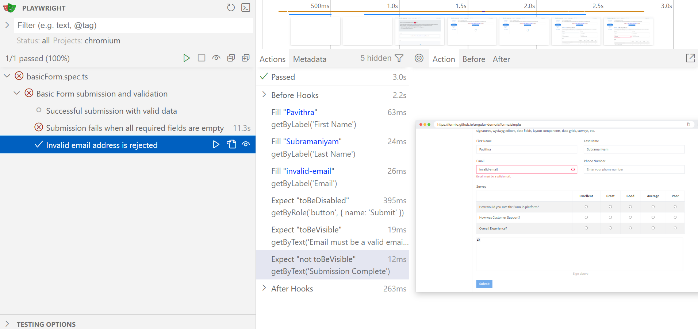

# Basic Form - Playwright Automation Assignment

## Overview
This repository contains automated UI tests for the Basic Form from the below mentioned angular-demo application. The objective of this assignment is to design and implement automated UI tests based on the provided user stories using Playwright with Typescript. The focus is on validating expected user-interface behavior and demonstrating test-case validation rather than validating the demo application.

#### Application under test:
https://formio.github.io/angular-demo/#/

## Testing Approach

### Requirement-Driven Testing (Primary)
The primary test suite is implemented strictly based on the provided user stories. User stories were treated as the single source of truth. No additional validation rules were assumed beyond these statements. Few requirements like name and email validations were deliberately excluded from tests.

#### User story-based test suite (Covered in basicForm_strict)

* Submission is successful when all the required fields are filled
*	Submission is unsuccessful when all the required fields are missing
*	Invalid email addresses are blocked from submission

### Extended Coverage (Interest-Driven)
In addition to the core coverage, a small set of extended tests is included to express my interest and product understanding. These tests are clearly separated from user-story-driven tests and derived based on reasonable UI observations (e.g., required fields, radio button behavior)

#### Derived test suite (Covered in basicForm_extended)

*	Submission is unsuccessful when Firstname is missing
*	Submission is unsuccessful when Lastname missing
*	Submission is unsuccessful when email is missing
*	Submission is successful when all the survey questions are answered
*	Survey questions allow only one option to be selected per question
*	Submission is unsuccessful when one or more survey questions are left unanswered

These gaps are intentionally surfaced through failing tests.

## Design Rationale
### Locators
  * Role-based locators (```getByRole()```) for interactive elements such as buttons and links
  * Label-based locators (```getByLabel()```) for form controls where labels are semantically associated with inputs
  * Text-based locators (```getByText()```) for locating elements that contain given text

In certain cases, semantic locators were not applicable due to the structure of the demo application. In such cases, CSS-based locators were used(e.g. survey root container).

### Assertions
Playwright includes test assertions in the form of ```expect``` function. To make an assertion, call ```expect(value)``` and choose a matcher that reflects the expectation. There are many generic matchers like ```toEqual```, ```toContain```, ```toBeTruthy``` that can be used to assert any conditions.
The following Playwright assertions are used in this assignment:
  * ```toBeVisible()```
  * ```not.toBeVisible()```
  * ```toBeDisabled()```
  * ```toBeChecked()```
  * ```not.toBeChecked()```

## How to Run the Tests
```bash
npm install
npx playwright test
```

To open UI mode, run the following command in your terminal:
```bash
npx playwright test --ui
```

## Example Test Case

Below is an example test from the user-story-driven suite validating form submission behavior.


